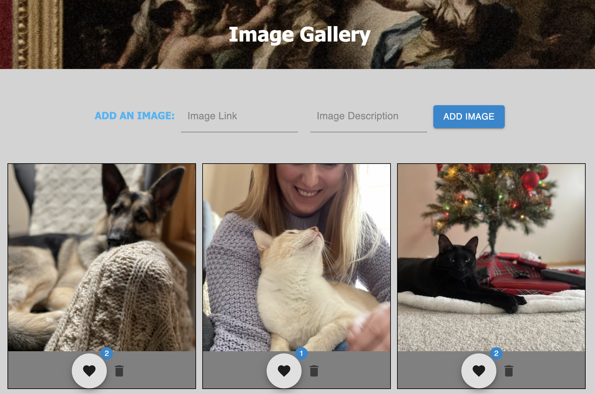
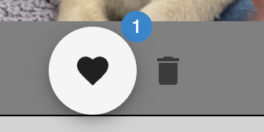
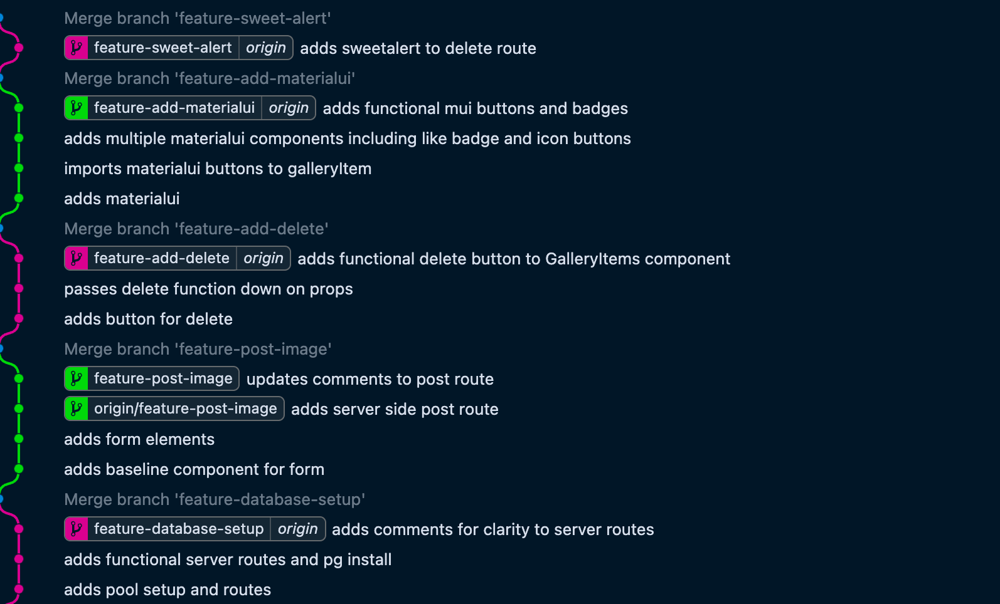

# Full-Stack Image Gallery

This is my first official full-stack, full crud web app: a familiar format of an image gallery with simple interactions: 

- Click on an image to view its description
- Click the :heart: button to increase the likes badge on the image
- Click the delete icon button to delete the image - select the confirm button to validate the delete
- Add a new image by providing a link (only absolute links accepted at this time) and an image description

All styling done with CSS and Material UI, with the addition of Sweet Alerts on the delete route. 

Project employs Javascript, Node.js, Express.js. pg.js, Postgresql for back-end logic and interaction, and Javascript and React.js for front-end. 

## Project Highlights

#### Architecting with React.js

This project was my first deployed experiment with React.js, and employs the use of most fundamental features of the framework: particularly component nesting and passing functions and variables on props. Moreso than the other frameworks I have worked with, I am pleased with how seamlessly I was able to integrate my companion libraries, including MaterialUI.

Before building the app, I spent time architecting my component and database layout, and created a baseline framework for my expected variables and functions to be passed on props. This planning process allowed me to be efficient with my limited time for this project by allowing me to prioritize functionality of the most critical components and functions first. 

#### Styling with MaterialUI

Most of my other Javascript projects have relied heavily on Bootstrap and Sass for styling - this project was my first foray into Material UI. I was able to successfully deploy Floating Action Buttons, Icon Buttons and Badges, but spent a significant portion of my time learning the other implementations for future projects. 

#### Git Branching and Merging

This project was a great exercise in becoming more familiar with Git - for every feature I added, I created a new branch to keep the main branch clean and functional throughout the process.

